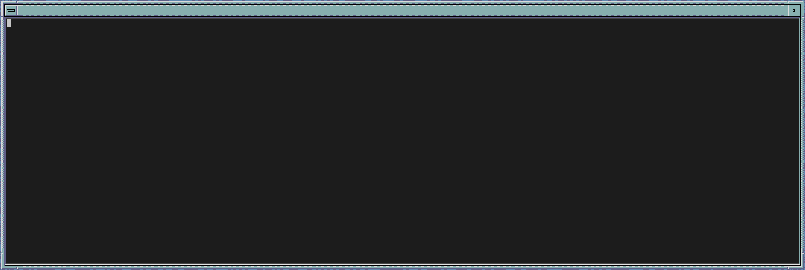

# ttyvid

Complete terminal recording and video generation tool. Record terminal sessions directly to .cast files, then convert to GIF/WebM with themes, animations, and custom fonts. High-performance Rust implementation with built-in PTY recording, full terminal emulation, TrueType font support, and 56+ embedded classic bitmap fonts.



*Example: fdwm-x theme with animated window decoration overlay and 9-slice frame scaling*


*Example: Full-size terminal recording*

## Features

- ✅ **Built-in recording** - Direct PTY-based terminal capture to .cast files
- ✅ **Full terminal emulation** - ANSI/VT100 escape sequences
- ✅ **Multiple output formats** - .cast (asciicast v2), GIF, and WebM (with AV1)
- ✅ **56 embedded fonts** - IBM, ATI, Verite, Tandy, Phoenix, and more
- ✅ **TrueType font support** - Load system fonts with full UTF-8 rendering
- ✅ **Terminal cloning** - Auto-detect terminal size, colors, and font with `--clone`
- ✅ **UTF-8 character support** - 310+ box-drawing, braille, and special characters
- ✅ **Theme system** - Customizable layouts with layers and animations
- ✅ **MCP server integration** - Built-in Model Context Protocol server with 11 tools for AI assistants
- ✅ **Platform optimization** - One-command optimization for Twitter, YouTube, TikTok, etc. with time controls
- ✅ **GPU acceleration** - wgpu support for dramatically faster rendering with automatic CPU fallback
- ✅ **Asciicast compatibility** - .cast files work with asciinema players
- ✅ **Speed control** - Adjust playback speed and FPS
- ✅ **Frame optimization** - Full frame encoding for perfect rendering

## Installation

### From crates.io

```bash
cargo install ttyvid
```

### From Source

```bash
git clone https://github.com/watkinslabs/ttyvid.git
cd ttyvid
cargo build --release
```

The binary will be at `target/release/ttyvid`.

### MCP Integration (Model Context Protocol)

Use ttyvid directly from Claude Code and other AI assistants! The MCP server is built directly into ttyvid - no separate installation needed.

**Configure Claude Code:**

Add to your MCP settings (e.g., `~/.config/claude/mcp.json`):
```json
{
  "mcpServers": {
    "ttyvid": {
      "command": "ttyvid",
      "args": ["--mcp"]
    }
  }
}
```

Or if installed via cargo:
```json
{
  "mcpServers": {
    "ttyvid": {
      "command": "/path/to/ttyvid",
      "args": ["--mcp"]
    }
  }
}
```

**Start MCP server manually (for testing):**
```bash
ttyvid --mcp
```

The server runs on stdio and implements the Model Context Protocol 2025-06-18, exposing these tools:

**Core Tools:**
- `record` - Record terminal sessions directly to .cast, GIF, or WebM
- `convert_recording` - Convert .cast files to GIF/WebM with full customization
  - Supports: themes, fonts (bitmap & TrueType), custom dimensions, speed control, multi-format output
- `get_version` - Get ttyvid version information

**Discovery Tools:**
- `list_themes` - List all 10 available themes
- `list_fonts` - List all 56+ embedded bitmap fonts
- `list_system_fonts` - List all available system TrueType fonts (monospace recommended)

**Analysis Tools:**
- `inspect_recording` - Analyze .cast files (dimensions, duration, event count, metadata)
- `preview_frame` - Generate single frame preview at specific timestamp
- `preview_theme` - Generate theme preview showing color palette

**Batch Tools:**
- `batch_convert` - Convert multiple .cast files in one operation

**Platform Optimization:**
- `optimize_for_platform` - Auto-optimize for Twitter, YouTube, LinkedIn, TikTok, GitHub, Instagram, Slack, DEV.to
  - Platform-specific presets (dimensions, FPS, themes, compression)
  - **Time control:** `fit_to_time` - automatically speed up video to fit target duration
  - **Trimming:** `start_time` / `end_time` - trim video to specific time range
  - One command for perfect social media output

**Use it naturally in Claude:**
```
User: "List available system fonts"
Claude: [Uses list_system_fonts tool]
Claude: "Found 116 fonts including Liberation Mono, Noto Sans Mono, Source Code Pro..."

User: "Convert my recording.cast to GIF with fdwm-x theme at 30fps using JetBrains Mono"
Claude: [Automatically converts using ttyvid MCP tool]
Claude: "Done! Created output.gif with fdwm-x theme at 30fps using JetBrains Mono font"

User: "What's in this demo.cast file?"
Claude: [Uses inspect_recording tool]
Claude: "This recording is 80x24, runs for 45.2 seconds, and has 1,234 events"

User: "Optimize this for Twitter"
Claude: [Uses optimize_for_platform with platform='twitter']
Claude: "Optimized for Twitter! Created square 680x680 GIF at 10fps with simple theme. Ready to tweet!"

User: "Fit this 60 second demo into 30 seconds for Instagram"
Claude: [Uses optimize_for_platform with platform='instagram', fit_to_time=30]
Claude: "Optimized for Instagram! Sped up 2.0x to fit 60s into 30s, square 1080x1080 at 12fps."

User: "Trim the first 5 seconds and last 10 seconds, then optimize for YouTube"
Claude: [Uses optimize_for_platform with platform='youtube', start_time=5.0, end_time=-10]
Claude: "Optimized for YouTube! Trimmed to 5.0s-50.0s (45s total), 720p at 15fps."
```

### Quick Start

**Complete workflow:**
```bash
# Step 1: Record a terminal session to .cast file
ttyvid record demo.cast
# ... interact with your terminal ...
# Exit shell (Ctrl+D or 'exit') to stop recording

# Step 2: Convert .cast to GIF or WebM
ttyvid convert -i demo.cast -o demo.gif
```

**Direct conversion (without recording):**
```bash
# Convert live terminal output via pipe
echo "Hello World" | ttyvid convert -o hello.gif

# Convert existing asciicast file
ttyvid convert -i recording.cast -o output.gif
```

**Output formats:**
```bash
# .cast file - Asciicast v2 format (compatible with asciinema)
ttyvid record output.cast

# GIF - Animated GIF with themes and effects
ttyvid convert -i recording.cast -o output.gif

# WebM - AV1-encoded video (requires --features webm)
ttyvid convert -i recording.cast -o output.webm
```

**Advanced options:**
```bash
# Clone your terminal appearance (auto-detect size, colors, and font)
ttyvid convert -i recording.cast -o output.gif --clone

# Use system font with UTF-8 support
ttyvid convert -i recording.cast -o output.gif --system-font "JetBrains Mono"

# Apply theme with custom settings
ttyvid convert -i recording.cast -o output.gif --theme fdwm-x --fps 30 --speed 1.5
```

### Advanced Features

#### TrueType Font Support

Use system fonts instead of bitmap fonts for better UTF-8 character support:

```bash
# Use a specific system font
ttyvid convert -i recording.cast -o output.gif --system-font "JetBrains Mono"

# Use system default monospace font
ttyvid convert -i recording.cast -o output.gif --system-font monospace

# Keywords: "monospace", "default", or "system" all use system default
ttyvid convert -i recording.cast -o output.gif --system-font default

# Specify font size (in pixels, default: 16)
ttyvid convert -i recording.cast -o output.gif --system-font monospace --font-size 20

# Load font from file path
ttyvid convert -i recording.cast -o output.gif --system-font /path/to/font.ttf
```

**List available fonts:**
```bash
# List all system TrueType fonts
ttyvid list-fonts --system

# List embedded bitmap fonts
ttyvid list-fonts --bitmap

# List both
ttyvid list-fonts
```

**Font features:**
- Full Unicode/UTF-8 rendering with proper baseline alignment
- Automatic cell sizing based on font metrics
- Supports font files (.ttf, .otf) or font names
- **Note:** Use monospace fonts designed for terminals for best results
- Non-monospace fonts will work but may not look ideal

**Font fallback chain:**
- If specified font not found, tries system default monospace
- Finally falls back to embedded bitmap fonts
- Supports loading from file paths or system font directories

#### Terminal Cloning

Clone your current terminal's appearance for authentic recordings:

```bash
# Auto-detect terminal size, colors, and font
ttyvid convert -i recording.cast -o output.gif --clone

# Just use terminal colors (with theme or bitmap font)
ttyvid convert -i recording.cast -o output.gif --terminal-colors
```

**What gets cloned:**
- Terminal dimensions (width × height)
- Full 16-color palette
- Default foreground/background colors
- System font (with TrueType support)

#### Color Support

ttyvid supports full 256-color terminal palettes with automatic terminal color detection:

**256-Color Palette:**
- **System colors (0-15)**: Standard ANSI colors (black, red, green, yellow, blue, magenta, cyan, white + bright variants)
- **Color cube (16-231)**: 6×6×6 RGB color cube for extended color support
- **Grayscale (232-255)**: 24-level grayscale ramp for smooth gradients

**Color modes:**
```bash
# Use theme's predefined palette
ttyvid convert -i recording.cast -o output.gif --theme fdwm-x

# Query and use your terminal's actual colors
ttyvid convert -i recording.cast -o output.gif --terminal-colors

# Clone terminal appearance (includes colors, size, and font)
ttyvid convert -i recording.cast -o output.gif --clone
```

**Terminal color querying:**
- Automatically detects your terminal's 16 ANSI colors
- Queries default foreground/background colors via OSC sequences
- Falls back to standard palette if querying fails
- Works with most modern terminal emulators

**Implementation:**
- `src/renderer/colors.rs:60-108` - Full 256-color palette with system/cube/grayscale
- `src/renderer/colors.rs:19-58` - Live terminal color querying via OSC 4/10/11

#### UTF-8 Character Support

310+ Unicode characters supported for TUI applications like bpytop, htop, etc.:

- **Box-drawing:** Single/double line, rounded corners, mixed styles
- **Block elements:** Full, half, quarter blocks in all orientations
- **Braille patterns:** All 256 patterns (⠀ through ⣿) for graphs
- **Arrows and symbols:** ←↑→↓, ▲▼◀▶, •◆■□, and more
- **Math symbols:** ≈≥≤≠±×÷°, fractions, superscripts

**Rendering modes:**
- Bitmap fonts: UTF-8 → CP437 mapping for compatibility
- TrueType fonts: Native UTF-8 rendering with full Unicode support

## Recording

ttyvid includes built-in PTY-based terminal recording, eliminating the need for external tools like asciinema.

### Basic Recording

```bash
# Start recording - launches your default shell
ttyvid record output.cast

# Record with custom shell
ttyvid record output.cast --shell /bin/zsh

# Record with specific dimensions
ttyvid record output.cast --columns 120 --rows 30
```

### Recording Options

```
ttyvid record [OPTIONS] <OUTPUT>

Arguments:
  <OUTPUT>  Output .cast file path

Options:
  -s, --shell <SHELL>      Shell to execute [default: $SHELL or /bin/sh]
  -c, --columns <COLS>     Terminal width [default: 80]
  -r, --rows <ROWS>        Terminal height [default: 24]
  -h, --help               Print help
```

### How Recording Works

- Spawns a PTY (pseudo-terminal) with the specified shell
- Captures all output with precise microsecond timing
- Saves to .cast v2 format (compatible with asciinema)
- Automatically records terminal resize events
- Exit the shell (Ctrl+D or `exit`) to stop recording

### Recording Python Scripts

Python uses **buffered output** by default, which can cause issues with terminal recording. Understanding Python's buffering behavior is essential for successful recordings.

**Python Buffering Modes:**
- **Line-buffered** (when stdout is a TTY): Flushes on newline `\n` → Works perfectly ✅
- **Fully-buffered** (no newlines): Holds all output until program exits → Causes problems ❌

**Example - Works Fine:**
```python
# Line-buffered: newlines trigger output
for i in range(5):
    print(f"Frame {i}")  # Has \n at end
    time.sleep(0.5)
# ✅ Each frame recorded at 0.5s intervals
```

**Example - Gets Buffered:**
```python
# Fully-buffered: no newlines
for i in range(5):
    print(f"Frame {i}", end='')  # No \n!
    time.sleep(0.5)
# ❌ All output compressed into single event at exit
```

**Workarounds (no code changes needed):**

```bash
# Option 1: Use --python-unbuffered flag (easiest!)
ttyvid record output.cast --python-unbuffered -- python3 script.py

# Option 2: Set PYTHONUNBUFFERED environment variable
PYTHONUNBUFFERED=1 ttyvid record output.cast -- python3 script.py

# Option 3: Use python -u flag
ttyvid record output.cast -- python3 -u script.py
```

The `--python-unbuffered` flag automatically sets `PYTHONUNBUFFERED=1` for the recorded process, forcing Python to use unbuffered I/O mode where all output is immediately visible to ttyvid's PTY.

**Why this happens:** Python detects it's connected to a PTY and uses line-buffering, but without newlines (`\n`), output stays in the buffer until the program exits or the buffer fills up.

## Usage

### Convert: From stdin (pipe)

```bash
echo -e "Hello \e[31mRed\e[0m World" | ttyvid convert -o hello.gif
```

### Convert: From asciicast file

```bash
ttyvid convert -i recording.cast -o output.gif
```

### Convert: With custom theme and font

```bash
ttyvid convert -i recording.cast -o output.gif \
  --theme windows7 \
  --font IBM_VGA8 \
  --fps 30 \
  --speed 1.5
```

### Convert: Advanced options

```bash
ttyvid convert \
  --input recording.cast \
  --output output.gif \
  --theme mac \
  --font Verite_9x16 \
  --fps 30 \
  --speed 2.0 \
  --columns 80 \
  --rows 25 \
  --title "My Demo" \
  --no-gaps \
  --trailer
```

The `--trailer` option adds 1.5 seconds of the final frame at the end before looping, creating a pause effect for better viewing.

## Command Reference

### ttyvid record

```
ttyvid record [OPTIONS] <OUTPUT>

Arguments:
  <OUTPUT>  Output .cast file path

Options:
  -s, --shell <SHELL>      Shell to execute [default: $SHELL or /bin/sh]
  -c, --columns <COLS>     Terminal width [default: 80]
  -r, --rows <ROWS>        Terminal height [default: 24]
  -h, --help               Print help
```

### ttyvid convert

```
ttyvid convert [OPTIONS] --output <FILE>

Options:
  -i, --input <FILE>          Input asciicast file (reads from stdin if not provided)
  -o, --output <FILE>         Output file (.gif or .webm)
  -t, --theme <THEME>         Theme name or path [default: default]
  -f, --font <FONT>           Font name (bitmap font)
      --system-font <FONT>    System font name, file path, or TrueType/OpenType
                              Use "monospace", "default", or "system" for system default
      --font-size <SIZE>      Font size in pixels for TrueType fonts [default: 16]
      --clone                 Auto-detect terminal size, colors, and font
      --terminal-colors       Use terminal's color palette
      --fps <FPS>             Frames per second (3-100) [default: 10]
      --speed <SPEED>         Speed multiplier [default: 1.0]
  -c, --columns <COLUMNS>     Terminal width in columns
  -r, --rows <ROWS>           Terminal height in rows
  -l, --loop <LOOP>           Number of loops (0 = infinite) [default: 0]
  -d, --delay <DELAY>         Delay before loop restart (milliseconds) [default: 100]
  -g, --no-gaps               Remove gaps in recording
      --trailer               Add trailer at end
      --title <TITLE>         Title text
      --no-autowrap           Disable auto line wrap
      --no-cursor             Hide cursor in output
      --underlay <UNDERLAY>   Underlay image path
      --quality <QUALITY>     WebM quality 0-100 [default: 50]
  -h, --help                  Print help
  -V, --version               Print version
```

### ttyvid list-fonts

```
ttyvid list-fonts [OPTIONS]

Options:
      --system                Show system TrueType fonts
      --bitmap                Show embedded bitmap fonts
  -h, --help                  Print help

Examples:
  ttyvid list-fonts --system      # List all system fonts
  ttyvid list-fonts --bitmap      # List embedded bitmap fonts
  ttyvid list-fonts               # List both
```

### ttyvid --mcp

```
ttyvid --mcp

Start the Model Context Protocol (MCP) server for AI assistant integration.
The server runs on stdio and implements MCP version 2025-06-18.

Available MCP Tools (11 total):

Core Tools:
  - record                Record terminal sessions to .cast/GIF/WebM
  - convert_recording     Convert .cast files to GIF/WebM with full options
                         (themes, fonts, dimensions, speed, multi-format)
  - get_version          Get ttyvid version information

Discovery Tools:
  - list_themes          List all 10 available themes
  - list_fonts           List all 56+ embedded bitmap fonts
  - list_system_fonts    List all system TrueType fonts

Analysis Tools:
  - inspect_recording    Analyze .cast metadata (dimensions, duration, events)
  - preview_frame        Generate single frame preview at timestamp
  - preview_theme        Generate theme preview with color palette

Batch Tools:
  - batch_convert        Convert multiple .cast files at once

Platform Optimization:
  - optimize_for_platform  Auto-optimize for social media platforms
                          Platforms: twitter, youtube, linkedin, tiktok,
                                    github, instagram, slack, devto
                          Parameters:
                            - input: Path to .cast file (required)
                            - output: Output file path (required)
                            - platform: Target platform name (required)
                            - theme: Custom theme override (optional)
                            - fit_to_time: Target duration in seconds (optional)
                                          Automatically speeds up video to fit
                            - start_time: Trim start in seconds (optional)
                            - end_time: Trim end in seconds (optional)
                          Example: {"platform": "twitter"} → 680x680, 10fps, simple theme

Example:
  ttyvid --mcp            # Start MCP server on stdio

Integration:
  Add to ~/.config/claude/mcp.json:
  {
    "mcpServers": {
      "ttyvid": {
        "command": "ttyvid",
        "args": ["--mcp"]
      }
    }
  }
```

## Performance

This Rust implementation is significantly faster than the original Python/Cython version:

- **Startup time**: ~50-100ms
- **Frame generation**: Highly optimized with GPU batch rendering
- **Memory usage**: Efficient with object pooling
- **Binary size**: ~5-8 MB (release build with LTO)
- **Progress tracking**: Live ETA display and total time reporting

## Architecture

### Modules

- **cli**: Command-line argument parsing with record and convert subcommands (clap)
- **recorder**: PTY-based terminal session recording with .cast output
- **input**: stdin and asciicast file readers
- **terminal**: Full VT100/ANSI terminal emulator (vte)
- **renderer**: Text to pixel conversion with bitmap fonts
- **encoder**: GIF and WebM encoding with optimizations
- **theme**: Layer-based theme system with animations
- **assets**: Embedded fonts, themes, and layer images
- **mcp_server**: Model Context Protocol server for AI assistant integration

### Data Flow

**Recording:**
```
Shell → PTY → Recorder → .cast file
```

**Converting:**
```
Input (stdin/cast) → Terminal Emulator →
Renderer → Encoder → Output (GIF/WebM)
```

## Available Fonts

All fonts are automatically embedded at compile time from `themes/fonts/`:

- **IBM**: BIOS, CGA, EGA, VGA, MDA, PS/2, 3270pc, Conv, ISO8/9
- **ATI**: 8x8, 8x14, 8x16, 9x14, 9x16, SmallW_6x8
- **Phoenix**: BIOS, EGA_8x8, EGA_8x14, EGA_8x16, EGA_9x14
- **Compaq**: Thin_8x8, Thin_8x14, Thin_8x16
- **Tandy**: New/Old TV, New/Old 225, New Mono
- **Toshiba**: LCD_8x8, LCD_8x16
- **Verite**: 8x8, 8x14, 8x16, 9x14, 9x16 (default)
- **Wyse**: 700a, 700a-2y, 700b-2y
- **Others**: AMI_BIOS, DTK_BIOS, ITT_BIOS, VTech_BIOS, ATT_PC6300, AmstradPC1512, Kaypro2K, VGA_SquarePx

## Available Themes

Built-in themes in `themes/`:

- `default` - Classic terminal look
- `windows7` - Windows 7 CMD style with dialog frame
- `mac` - macOS Terminal style with window controls
- `fdwm` - Floating window manager theme
- `fdwm-x` - Extended window manager with animations
- `game` - Retro gaming console frame
- `bar` - Status bar theme
- `opensource` - Open source branding banner
- `scripted` - Script demonstration with annotations
- `simple` - Minimal theme (terminal only)

## Theme System

ttyvid features a powerful layer-based theme system that allows extensive customization of the final output with support for animated components, flexible positioning, and multiple scaling modes.

### Layer-Based Architecture

Themes are built from **layers** - individual image files (GIF/PNG) that are composited together:

- **Underlays** (depth < 0): Rendered behind the terminal output (backgrounds, frames)
- **Overlays** (depth ≥ 0): Rendered on top of the terminal output (window controls, decorations)

Each layer can be:
- **Static** or **animated** (multi-frame GIF)
- Positioned anywhere on the canvas
- Scaled using different algorithms
- Animated with custom speed and looping

### Layer Rendering Modes

Layers support multiple rendering modes for different visual effects:

#### Copy Mode
```yaml
mode: copy
```
Direct pixel-perfect copying from source to destination. Ideal for static decorative elements.

#### Tile Mode
```yaml
mode: tile
```
Repeats the layer image across the entire canvas. Perfect for textured backgrounds or patterns.

#### Center Mode
```yaml
mode: center
```
Centers the layer on the canvas. Useful for logos or centered decorative elements.

#### Scale Mode
```yaml
mode: scale
```
Scales the layer to fit the destination bounds using nearest-neighbor interpolation.

#### 9-Slice Scaling
```yaml
mode: 9slice
nineslice:
  outer_left: 10
  outer_top: 10
  outer_right: 10
  outer_bottom: 10
  inner_left: 20
  inner_top: 20
  inner_right: 20
  inner_bottom: 20
```
Advanced scaling that preserves corners and edges while stretching the center. Essential for window frames and dialogs that need to resize without distorting decorative borders.

**How it works:**
- Divides the source image into 9 regions (4 corners, 4 edges, 1 center)
- Corners remain fixed size
- Edges stretch in one direction only
- Center stretches in both directions

#### 3-Slice Scaling
```yaml
mode: 3slice
```
Similar to 9-slice but for horizontal or vertical stretching only. Useful for title bars and status bars.

### Animated Layers

Layers support animated GIF files with full control over playback:

```yaml
layers:
  - depth: -1
    file: layers/animated-background.gif
    mode: center
    animation:
      speed: 1.5        # 1.5x speed multiplier
      loop: true        # Loop animation
      start_frame: 0    # Start at first frame
```

**Animation features:**
- Multi-frame GIF support
- Independent speed control per layer
- Optional looping
- Frame timing preserved from source GIF
- Synchronized with video output timeline

### Layer Positioning

Flexible positioning system with support for absolute and relative coordinates:

```yaml
layers:
  - depth: 1
    file: layers/window-controls.gif
    mode: copy
    dst_bounds:
      left: 10          # 10 pixels from left
      top: 10           # 10 pixels from top
      right: -110       # 110 pixels from right edge (negative = from right)
      bottom: auto      # Auto-calculate based on image size
```

**Positioning options:**
- Absolute pixel coordinates
- Negative values offset from opposite edge
- `auto` for automatic sizing
- Per-layer bounds control

### Custom Theme Example

Create a custom theme with window frame and animated decorations:

```yaml
name: my-custom-theme
background: 0           # Black background
foreground: 7           # White text
transparent: 0          # Transparency color index

padding:
  left: 20
  top: 40
  right: 20
  bottom: 20

title:
  foreground: 15        # Bright white
  background: 4         # Red
  x: 30
  y: 10
  font_size: 1.5

layers:
  # Background frame (underlay)
  - depth: -1
    file: layers/my-frame.gif
    mode: 9slice
    nineslice:
      outer_left: 0
      outer_top: 0
      outer_right: auto
      outer_bottom: auto
      inner_left: 30
      inner_top: 30
      inner_right: auto
      inner_bottom: auto

  # Animated decoration (overlay)
  - depth: 1
    file: layers/spinner.gif
    mode: copy
    animation:
      speed: 2.0
      loop: true
    dst_bounds:
      left: -50
      top: 10
      right: auto
      bottom: auto
```

### Embedded vs Custom Layers

**Embedded layers** (included in binary):
- 11 pre-built layer images
- Loaded automatically by filename
- No external files needed

**Custom layers** (filesystem):
- Place images in `themes/layers/` or specify full path
- Falls back to embedded if not found
- Supports both GIF and PNG formats

### Creating Custom Layers

1. **Design your layer** in any image editor
2. **Export as GIF** (with animation if desired)
3. **Save to** `themes/layers/your-layer.gif`
4. **Reference in theme YAML:**
   ```yaml
   layers:
     - depth: -1
       file: layers/your-layer.gif
       mode: 9slice
   ```

### Theme Customization Workflow

1. Start with an existing theme as template
2. Modify colors, padding, and positioning
3. Add or replace layer images
4. Adjust animation speeds and rendering modes
5. Test with: `ttyvid -i test.cast -o output.gif --theme my-theme`

The theme system is fully extensible - you can mix embedded assets with custom images, create complex multi-layer compositions, and animate individual components independently for professional-looking terminal recordings.

## GPU Acceleration

ttyvid includes **GPU acceleration by default** using wgpu for dramatically faster frame rendering with GPU batch processing.

### Installation

```bash
# Default installation includes GPU support
cargo install ttyvid

# Build from source (includes GPU by default)
cargo build --release

# CPU-only build (opt-out of GPU for minimal binary)
cargo install ttyvid --no-default-features --features webm
```

### How It Works

- **GPU Batch Rendering**: Renders all frames in a single GPU operation with minimal CPU↔GPU syncs
- **Automatic Chunking**: Intelligently splits large frame counts to respect GPU buffer limits
- **Automatic CPU Fallback**: Seamlessly uses CPU if GPU unavailable or initialization fails
- **No External Dependencies**: wgpu compiles directly into the binary
- **Cross-Platform**: Works on Windows (DX12), macOS (Metal), Linux (Vulkan)
- **Enabled by Default**: GPU support included in standard installation with transparent fallback

### Performance Gains

GPU batch rendering provides significant speedups:

- **2-5x faster** on typical recordings (200-300 frames)
- **5-10x faster** on large recordings (1000+ frames, high resolution)
- **Single sync point** for all frames vs per-frame CPU syncs
- **Parallel frame processing** utilizing GPU compute units

### Progress Tracking

Both CPU and GPU modes feature enhanced progress display:

- **Live ETA**: Shows estimated time to completion ("ETA: 14.5s" or "ETA: 2.3m")
- **Total Time**: Displays elapsed time when complete ("total time: 1m 23s")
- **Clean Output**: Minimal logging during encoding

### When to Use GPU

- ✅ Large output dimensions (1280x720+, 1080p, 4K)
- ✅ High FPS videos (30+ fps)
- ✅ Long recordings (500+ frames)
- ✅ Batch processing many videos
- ✅ Local workstation with GPU

### When CPU-Only Is Fine

- ✅ Headless servers / Docker containers
- ✅ Small dimensions (640x480, 680x680)
- ✅ Low FPS (8-15 fps) - typical GIF range
- ✅ Short recordings (<200 frames)
- ✅ Single video conversions

## TODO

- [ ] SIMD optimizations for CPU path
- [ ] True color (24-bit RGB) support
- [ ] Additional output formats (MP4, APNG)

## Comparison with Original

| Feature | Original (Python) | ttyvid (Rust) | Status |
|---------|------------------|--------------|--------|
| Terminal Emulation | Custom | Full ANSI/VT100 | ✅ |
| GIF Encoding | Custom | gif crate | ✅ |
| WebM Encoding | N/A | rav1e (AV1) | ✅ |
| Font Support | 50+ .fd fonts | 56 bitmap + TrueType | ✅ |
| UTF-8 Characters | Limited | 310+ characters | ✅ |
| Terminal Cloning | N/A | Full (size/colors/font) | ✅ |
| Theme System | Full with layers | Full with layers | ✅ |
| GPU Acceleration | N/A | Default (wgpu batch) | ✅ |
| Progress Tracking | Basic | ETA + Total Time | ✅ |
| Performance | Good | Excellent | ✅ |
| Binary Size | N/A (Python) | ~5-8 MB | ✅ |
| Dependencies | Python + libs | None (static) | ✅ |

## Building from Source

### Requirements

- Rust 1.70+ (2021 edition)
- Cargo

### Build Commands

```bash
# Debug build
cargo build

# Release build (optimized)
cargo build --release

# Build with WebM support (requires rav1e)
cargo build --release --features webm

# Run tests
cargo test

# Run with example
echo "Test" | cargo run --release -- -o test.gif
```

### Build System

The project uses `build.rs` to automatically:
- Scan `themes/fonts/` directory
- Generate font embedding code at compile time
- Create font lookup tables

To add new fonts, simply place `.fd` files in `themes/fonts/` and rebuild.

## License

MIT

## Credits

- Original ttygif concept and fonts
- Rust implementation with modern architecture
- gif crate for GIF encoding
- rav1e for WebM/AV1 encoding

## Contributing

Contributions welcome! Areas of interest:

- Performance optimizations (SIMD, GPU, parallel)
- Additional output formats
- Extended color support (true color)
- Bug fixes and documentation
